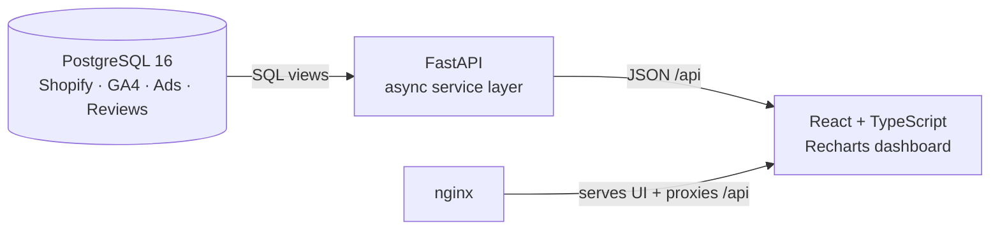

# Business Dashboard

**An e-commerce analytics dashboard built from scratch as a web app — database, API, and UI — instead of a BI tool.**

I'm a data analyst. This project is my answer to a question I kept running into: *what if the dashboard could do exactly what the business needs, not just what the BI tool allows?* So I built the whole stack myself — PostgreSQL → FastAPI → React — on top of real Shopify store data.

<!-- Add a screenshot or GIF here, e.g.:

-->

---

## Why a web app instead of a BI tool?

BI tools are great for fast, ad-hoc exploration. For a dashboard the team opens every day, building it as a web app gave me things that are hard to get in a BI tool:

| | BI tool | This dashboard |
|---|---|---|
| **Metric definitions** | Often re-created per chart, numbers can drift apart | One SQL definition of net sales, reused by every widget |
| **Layout & interaction** | Limited to the tool's components | Fully custom widgets, comparisons, and styling |
| **Access** | Per-seat licences | Anyone with the link, no licence |
| **Data privacy for demos** | Manual workarounds | Scripted anonymization that keeps business ratios intact |

The trade-off is honest: it takes longer to build. That's exactly why it's a learning project.

---

## Dashboard widgets

Each widget is designed around a business question. All widgets except the yearly comparison follow the global date range picker.

| Widget | Business question it answers | Details |
|---|---|---|
| **KPI cards** | *How are we doing this period vs. the previous one?* | Net Sales, Gross Sales, Total Qty, Total Orders, AOV — each with % change and a sparkline |
| **Revenue trend** | *Is this rise or drop seasonal, or a real trend?* | Area chart of net sales vs. the same period last year (daily / weekly / monthly granularity in the API) |
| **Revenue by channel** | *Which traffic channels bring in the money?* | Donut chart + legend table with revenue share per channel |
| **Top products** | *Which products are gaining or slowing down?* | Ranked by revenue, with units sold and change vs. the previous period |
| **Yearly comparison** | *How is this year tracking against last year, month by month?* | Grouped bar chart, current vs. previous year |

---

## Key design decisions

These are the parts I'm most proud of as an analyst — the "why" behind the numbers.

- **One source of truth for net sales.** The view `shopify.v_net_sales_lines` is *the* definition of net sales. Every endpoint aggregates it instead of re-deriving its own rule, so widgets can never disagree with each other.
- **Refunds are booked when they happen.** A return lands in the month it was processed, not back in the month of the original order — matching how the business actually sees its cash.
- **Business timezone, not server timezone.** All dates are bucketed in `America/New_York`, the store's timezone.
- **Money is never a float.** Monetary values use `Decimal` end-to-end to avoid rounding errors.
- **Anonymized public demo.** [`db/anonymize_demo.sql`](db/anonymize_demo.sql) turns a copy of the database into a demo dataset: customer, product, campaign, and review data are replaced, all money is scaled by one constant (so ROAS and AOV stay realistic), and the script verifies its own output and rolls back if any check fails.

---

## Architecture



- **Database** — PostgreSQL schema covering Shopify orders, GA4 sessions, paid ads, and Judge.me reviews ([`db/schema.sql`](db/schema.sql)).
- **Backend** — FastAPI with a layered structure: `api/` (routes) → `services/` (business logic + SQL) → `schemas/` (Pydantic DTOs). Alembic manages app-owned tables.
- **Frontend** — React function components with hooks, TypeScript strict mode, Tailwind CSS, Recharts.
- **Deployment** — Docker Compose stack (nginx + FastAPI + Postgres), with only port 80 exposed and the public API read-only.

## Tech stack

| Layer | Tools |
|---|---|
| Data | PostgreSQL 16, SQL views |
| Backend | Python 3.11, FastAPI, SQLAlchemy (async) + asyncpg, Pydantic, Alembic, uv |
| Frontend | React 19, TypeScript, Vite, Tailwind CSS, Recharts, Axios |
| DevOps | Docker, Docker Compose, nginx, Git/GitHub |

---

## API endpoints

| Method | Endpoint | Purpose |
|---|---|---|
| GET | `/api/revenue/summary` | KPI totals + period-over-period change |
| GET | `/api/revenue/trend` | Time series with year-over-year comparison |
| GET | `/api/revenue/by-channel` | Revenue breakdown by traffic channel |
| GET | `/api/revenue/yearly-comparison` | Monthly revenue, current vs. previous year |
| GET | `/api/products/top` | Top products with period comparison |
| GET / POST | `/api/annotations` | Timeline annotations (e.g. campaign launches) |

Most endpoints take `start_date` and `end_date` (`YYYY-MM-DD`). Interactive docs are available at `/docs` when running locally.

---

## Running locally

> The real store data is private and not included in this repo. You need a PostgreSQL database with the schema from `db/schema.sql` loaded.

**Backend**

```bash
cd backend
cp .env.example .env          # set DATABASE_URL
uv sync
uv run alembic upgrade head
uv run uvicorn app.main:app --reload     # http://localhost:8000
```

**Frontend**

```bash
cd frontend
npm install
npm run dev                   # http://localhost:5173 (proxies /api to the backend)
```

**Full stack with Docker**

```bash
cp .env.example .env          # set POSTGRES_PASSWORD
docker compose up -d --build  # http://localhost
```

See [`docs/deploy-gcp.md`](docs/deploy-gcp.md) for building the anonymized demo database and deploying to a GCP VM.

---

## Project structure

```
backend/
  app/
    api/         # FastAPI routers
    services/    # business logic + SQL queries
    schemas/     # Pydantic response models
    models/      # SQLAlchemy models (app-owned tables)
    core/, db/   # config and database session
  migrations/    # Alembic migrations
frontend/
  src/components/  # dashboard widgets
db/
  schema.sql         # database schema and views
  anonymize_demo.sql # demo data anonymization
docs/
  deploy-gcp.md
```

---

## What I learned

I started this project on 4 August 2026 with one year of Python and only basic HTML/CSS. Along the way I learned:

- designing SQL views that encode business rules once, instead of in every query
- building an async REST API with a clean service layer and typed DTOs
- React and TypeScript from zero: components, hooks, state, and data fetching
- turning analysis into visuals people can read at a glance
- containerizing an app and preparing it for a public, privacy-safe demo

## Roadmap

- [ ] Public live demo on GCP
- [ ] Annotations shown on the trend chart
- [ ] Ads and GA4 widgets (ROAS, sessions, conversion rate)
- [ ] Authentication for private dashboards

---

Built by **Putu Pradadipa** · [GitHub](https://github.com/Pradadipa)
<!-- Add your LinkedIn URL here -->
